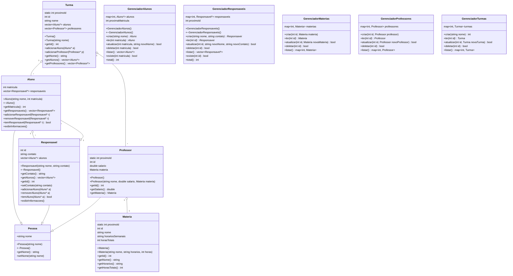

# Diagrama de Classes UML

```mermaid
classDiagram
    class Pessoa {
        +string nome
        +Pessoa(string nome)
        +~Pessoa()
        +getNome() string
        +setNome(string nome)
    }

    class Aluno {
        int matricula
        vector~Responsavel*~ responsaveis
        +Aluno(string nome, int matricula)
        +~Aluno()
        +getMatricula() int
        +getResponsaveis() vector~Responsavel*~
        +adicionarResponsavel(Responsavel* r)
        +removerResponsavel(Responsavel* r)
        +temResponsavel(Responsavel* r) bool
        +exibirInformacoes()
    }
    Aluno --|> Pessoa
    Aluno "1" o-- "*" Responsavel

    class Responsavel {
        int id
        string contato
        vector~Aluno*~ alunos
        +Responsavel(string nome, string contato)
        +~Responsavel()
        +getContato() string
        +getAlunos() vector~Aluno*~
        +getId() int
        +setContato(string contato)
        +adicionarAluno(Aluno* a)
        +removerAluno(Aluno* a)
        +temAluno(Aluno* a) bool
        +exibirInformacoes()
    }
    Responsavel --|> Pessoa
    Responsavel "1" o-- "*" Aluno

    class Materia {
        static int proximoId
        int id
        string nome
        string horariosSemanais
        int horasTotais
        +Materia()
        +Materia(string nome, string horarios, int horas)
        +getId() int
        +getNome() string
        +getHorarios() string
        +getHorasTotais() int
    }

    class Professor {
        static int proximoId
        int id
        double salario
        Materia materia
        +Professor()
        +Professor(string nome, double salario, Materia materia)
        +getId() int
        +getSalario() double
        +getMateria() Materia
    }
    Professor --|> Pessoa
    Professor "1" o-- "1" Materia

    class Turma {
        static int proximoId
        int id
        string nome
        vector~Aluno*~ alunos
        vector~Professor*~ professores
        +Turma()
        +Turma(string nome)
        +getId() int
        +adicionarAluno(Aluno* a)
        +adicionarProfessor(Professor* p)
        +getNome() string
        +getAlunos() vector~Aluno*~
        +getProfessores() vector~Professor*~
    }
    Turma "1" o-- "*" Aluno
    Turma "1" o-- "*" Professor

    class GerenciadorAlunos {
        map~int, Aluno*~ alunos
        int proximaMatricula
        +GerenciadorAlunos()
        +~GerenciadorAlunos()
        +criar(string nome) Aluno*
        +ler(int matricula) Aluno*
        +atualizar(int matricula, string novoNome) bool
        +deletar(int matricula) bool
        +listar() vector~Aluno*~
        +existe(int matricula) bool
        +total() int
    }

    class GerenciadorResponsaveis {
        map~int, Responsavel*~ responsaveis
        int proximoId
        +GerenciadorResponsaveis()
        +~GerenciadorResponsaveis()
        +criar(string nome, string contato) Responsavel*
        +ler(int id) Responsavel*
        +atualizar(int id, string novoNome, string novoContato) bool
        +deletar(int id) bool
        +listar() vector~Responsavel*~
        +existe(int id) bool
        +total() int
    }

    class GerenciadorMaterias {
        map~int, Materia~ materias
        +criar(int id, Materia materia)
        +ler(int id) Materia*
        +atualizar(int id, Materia novaMateria) bool
        +deletar(int id) bool
        +listar() map~int, Materia~
    }

    class GerenciadorProfessores {
        map~int, Professor~ professores
        +criar(int id, Professor professor)
        +ler(int id) Professor*
        +atualizar(int id, Professor novoProfessor) bool
        +deletar(int id) bool
        +listar() map~int, Professor~
    }

    class GerenciadorTurmas {
        map~int, Turma~ turmas
        +criar(string nome) int
        +ler(int id) Turma*
        +atualizar(int id, Turma novaTurma) bool
        +deletar(int id) bool
        +listar() map~int, Turma~
    }
```
