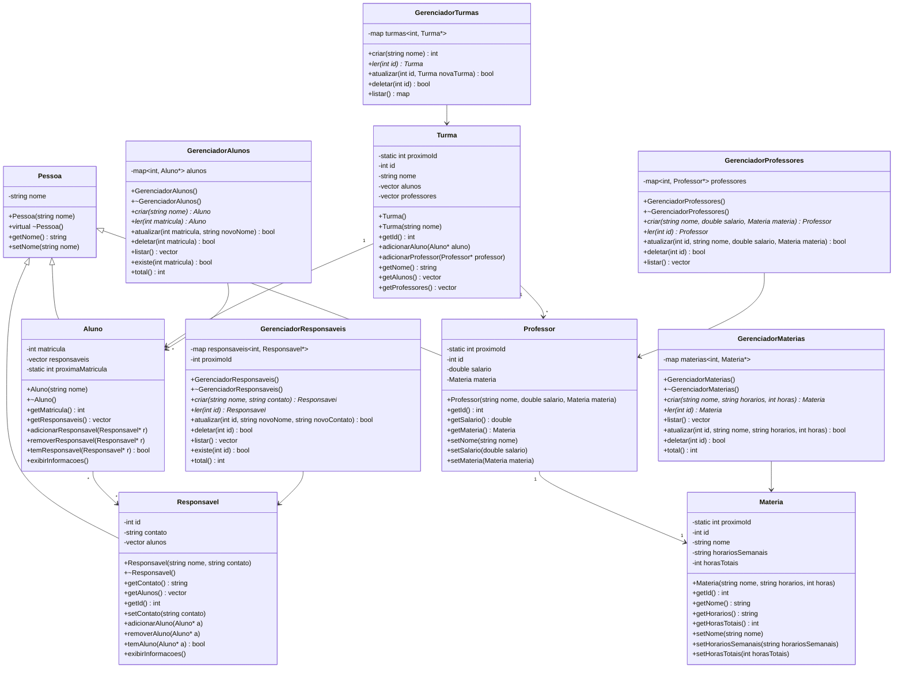

# Diagrama de Classes UML

```mermaid
classDiagram
    class Pessoa {
	    -string nome
	    +Pessoa(string nome)
	    +virtual ~Pessoa()
	    +getNome() string
	    +setNome(string nome)
    }

    class Aluno {
	    -int matricula
	    -vector responsaveis
	    -static int proximaMatricula
	    +Aluno(string nome)
	    +~Aluno()
	    +getMatricula() int
	    +getResponsaveis() vector
	    +adicionarResponsavel(Responsavel* r)
	    +removerResponsavel(Responsavel* r)
	    +temResponsavel(Responsavel* r) bool
	    +exibirInformacoes()
    }

    class Responsavel {
	    -int id
	    -string contato
	    -vector alunos
	    +Responsavel(string nome, string contato)
	    +~Responsavel()
	    +getContato() string
	    +getAlunos() vector
	    +getId() int
	    +setContato(string contato)
	    +adicionarAluno(Aluno* a)
	    +removerAluno(Aluno* a)
	    +temAluno(Aluno* a) bool
	    +exibirInformacoes()
    }

    class Materia {
	    -static int proximoId
	    -int id
	    -string nome
	    -string horariosSemanais
	    -int horasTotais
	    +Materia(string nome, string horarios, int horas)
	    +getId() int
	    +getNome() string
	    +getHorarios() string
	    +getHorasTotais() int
	    +setNome(string nome)
	    +setHorariosSemanais(string horariosSemanais)
	    +setHorasTotais(int horasTotais)
    }

    class Professor {
	    -static int proximoId
	    -int id
	    -double salario
	    -Materia materia
	    +Professor(string nome, double salario, Materia materia)
	    +getId() int
	    +getSalario() double
	    +getMateria() Materia
	    +setNome(string nome)
	    +setSalario(double salario)
	    +setMateria(Materia materia)
    }

    class Turma {
	    -static int proximoId
	    -int id
	    -string nome
	    -vector alunos
	    -vector professores
	    +Turma()
	    +Turma(string nome)
	    +getId() int
	    +adicionarAluno(Aluno* aluno)
	    +adicionarProfessor(Professor* professor)
	    +getNome() string
	    +getAlunos() vector
	    +getProfessores() vector
    }

    class GerenciadorAlunos {
	    -map~int, Aluno*~ alunos
	    +GerenciadorAlunos()
	    +~GerenciadorAlunos()
	    +criar(string nome) Aluno*
	    +ler(int matricula) Aluno*
	    +atualizar(int matricula, string novoNome) bool
	    +deletar(int matricula) bool
	    +listar() vector
	    +existe(int matricula) bool
	    +total() int
    }

    class GerenciadorResponsaveis {
	    -map responsaveis~int, Responsavel*~
	    -int proximoId
	    +GerenciadorResponsaveis()
	    +~GerenciadorResponsaveis()
	    +criar(string nome, string contato) Responsavel*
	    +ler(int id) Responsavel*
	    +atualizar(int id, string novoNome, string novoContato) bool
	    +deletar(int id) bool
	    +listar() vector
	    +existe(int id) bool
	    +total() int
    }

    class GerenciadorMaterias {
	    -map materias~int, Materia*~
	    +GerenciadorMaterias()
	    +~GerenciadorMaterias()
	    +criar(string nome, string horarios, int horas) Materia*
	    +ler(int id) Materia*
	    +listar() vector
	    +atualizar(int id, string nome, string horarios, int horas) bool
	    +deletar(int id) bool
	    +total() int
    }

    class GerenciadorProfessores {
	    -map~int, Professor*~ professores
	    +GerenciadorProfessores()
	    +~GerenciadorProfessores()
	    +criar(string nome, double salario, Materia materia) Professor*
	    +ler(int id) Professor*
	    +atualizar(int id, string nome, double salario, Materia materia) bool
	    +deletar(int id) bool
	    +listar() vector
    }

    class GerenciadorTurmas {
	    -map turmas~int, Turma*~
	    +criar(string nome) int
	    +ler(int id) Turma*
	    +atualizar(int id, Turma novaTurma) bool
	    +deletar(int id) bool
	    +listar() map
    }

    Pessoa <|-- Aluno
    Pessoa <|-- Professor
    Pessoa <|-- Responsavel
    Aluno "*" --> "*" Responsavel
    Professor "1" --> "1" Materia
    Turma "1" --> "*" Aluno
    Turma "1" --> "*" Professor
    GerenciadorAlunos --> Aluno
    GerenciadorMaterias --> Materia
    GerenciadorProfessores --> Professor
    GerenciadorResponsaveis --> Responsavel
    GerenciadorTurmas --> Turma
```
